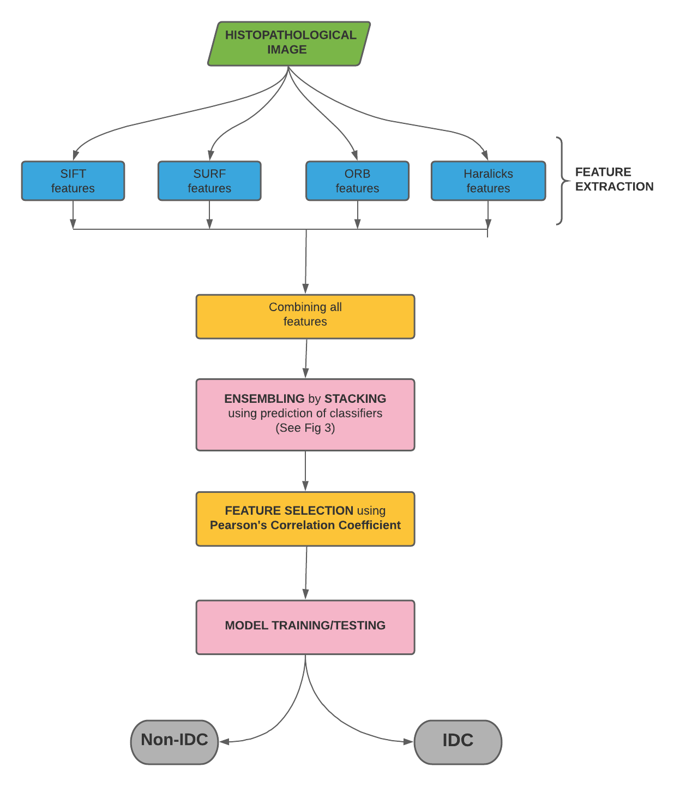
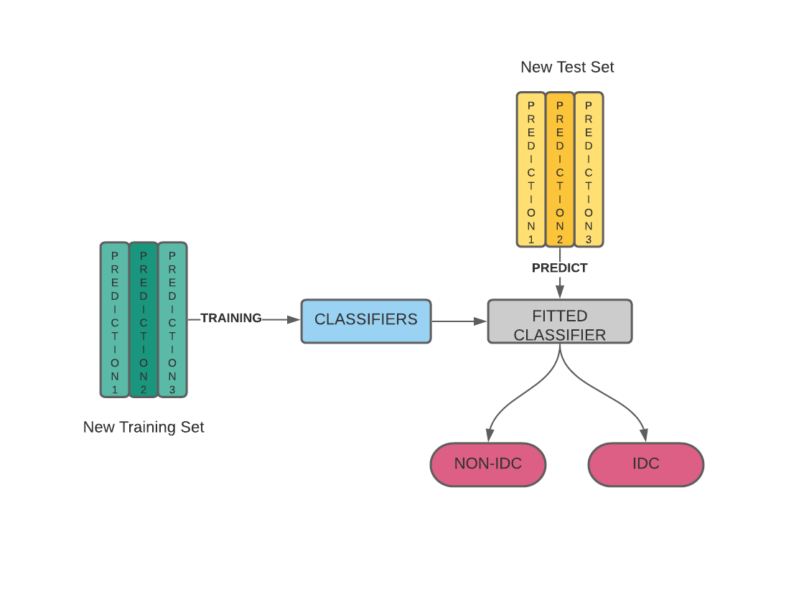
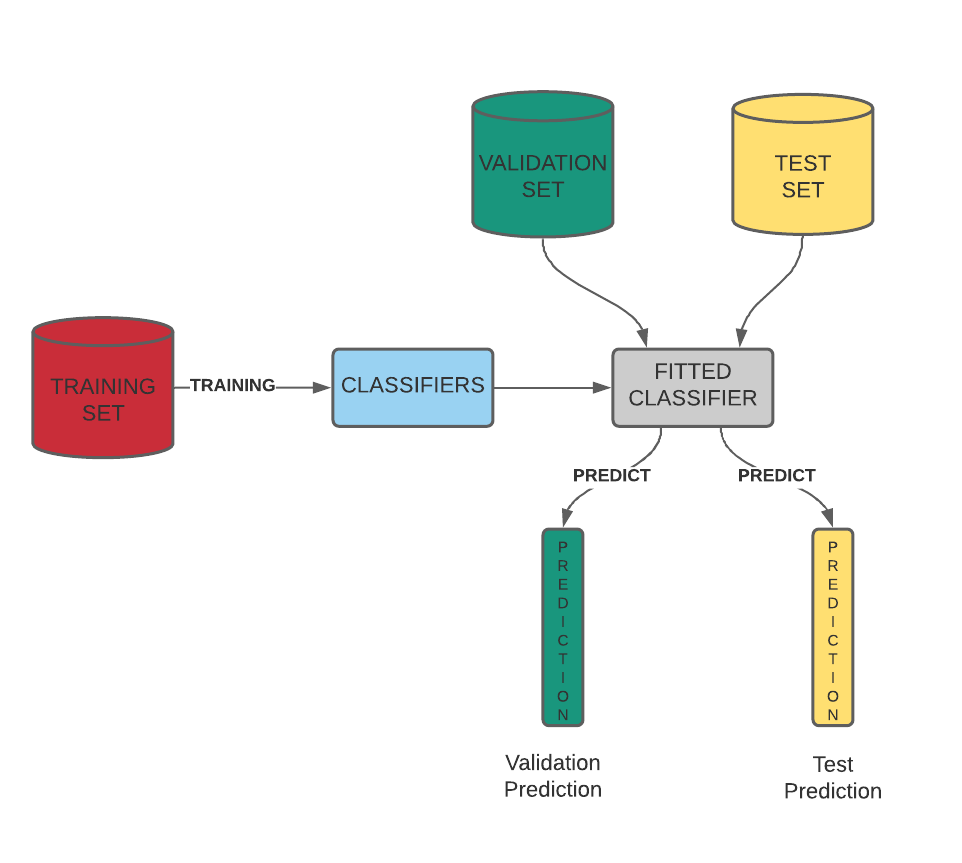

# Computer-Aided-Breast-Cancer-Detection-using-Ensembling-of-Texture-and-Statistical-Image-Features
## MDPI: Sensors

### Authors: Soumya Deep Roy, Soham Das, Devroop Kar, Friedhelm Schwenker and Ram Sarkar

(1) Department of Metallurgical and Material Engineering, Jadavpur University, Kolkata -700032, India

(2) Department of Computer Science and Engineering, Jadavpur University, Kolkata -700032, India

(3) Institute of Neural Information Processing, Ulm University, Ulm, Germany

